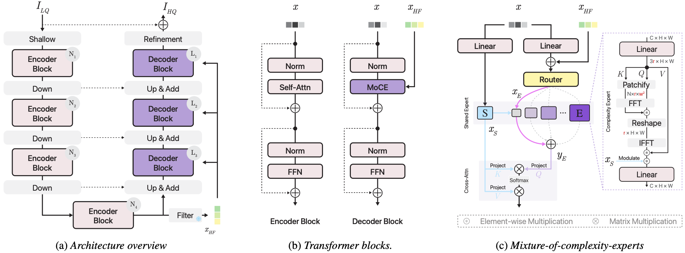

# MoCE-IR - CVPR 2025


### Complexity Experts are Task-Discriminative Learners for Any Image Restoration

#### [Eduard Zamfir<sup>1</sup>](https://eduardzamfir.github.io), [Zongwei Wu<sup>1</sup>](https://sites.google.com/view/zwwu/accueil), [Nancy Mehta<sup>1</sup>](https://scholar.google.com/citations?user=WwdYdlUAAAAJ&hl=en&oi=ao), [Yuedong Tan<sup>1</sup>](https://scholar.google.com/citations?user=p7fOQkUAAAAJ&hl=en), 
#### [Danda Pani Paudel<sup>2</sup>](https://insait.ai/dr-danda-paudel/),  [Yulun Zhang<sup>3</sup>](http://yulunzhang.com/) and [Radu Timofte<sup>1</sup>](https://scholar.google.com/citations?user=u3MwH5kAAAAJ&hl=en&oi=sra)

#### **<sup>1</sup> University of Würzburg, Germany - <sup>2</sup> INSAIT Sofia University, Bulgaria - <sup>3</sup> Shanghai Jiao Tong University, China**

[](http://arxiv.org/abs/2411.18466)
[](https://eduardzamfir.github.io/moceir)


## Latest
- `02/27/2025`: Our work got accepted at CVPR 2025! Stay tuned for full code & model release. 🎉🥳
- `11/28/2024`: Repository is created.

## Method
<br>
<details>
  <summary>
  <font size="+1">Abstract</font>
  </summary>
Recent advancements in all-in-one image restoration models have revolutionized the ability to address diverse degradations through a unified framework. However, parameters tied to specific tasks often remain inactive for other tasks, making mixture-of-experts (MoE) architectures a natural extension. Despite this, MoEs often show inconsistent behavior, with some experts unexpectedly generalizing across tasks while others struggle within their intended scope. This hinders leveraging MoEs' computational benefits by bypassing irrelevant experts during inference.
We attribute this undesired behavior to the uniform and rigid architecture of traditional MoEs. To address this, we introduce ``complexity experts" -- flexible expert blocks with varying computational complexity and receptive fields. A key challenge is assigning tasks to each expert, as degradation complexity is unknown in advance. Thus, we execute tasks with a simple bias toward lower complexity.
To our surprise, this preference effectively drives task-specific allocation, assigning tasks to experts with the appropriate complexity. 
Extensive experiments validate our approach, demonstrating the ability to bypass irrelevant experts during inference while maintaining superior performance. The proposed MoCE-IR model outperforms state-of-the-art methods, affirming its efficiency and practical applicability.
</details>



## Citation

If you find our work helpful, please consider citing the following paper and/or ⭐ the repo.
```
@misc{zamfir2024complexityexperts,
      title={Complexity Experts are Task-Discriminative Learners for Any Image Restoration}, 
      author={Eduard Zamfir and Zongwei Wu and Nancy Mehta and Yuedong Tan and Danda Pani Paudel and Yulun Zhang and Radu Timofte},
      year={2024},
      eprint={2411.18466},
      archivePrefix={arXiv},
      primaryClass={cs.CV},
}
```

## Acknowledgements

This code is built on [PromptIR](https://github.com/va1shn9v/PromptIR) and [AirNet](https://github.com/XLearning-SCU/2022-CVPR-AirNet).
